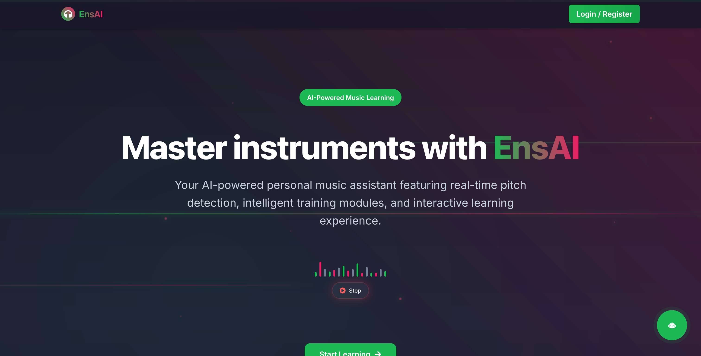
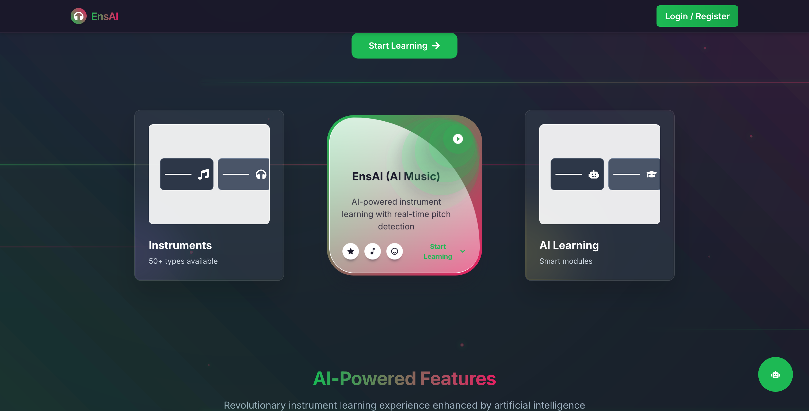
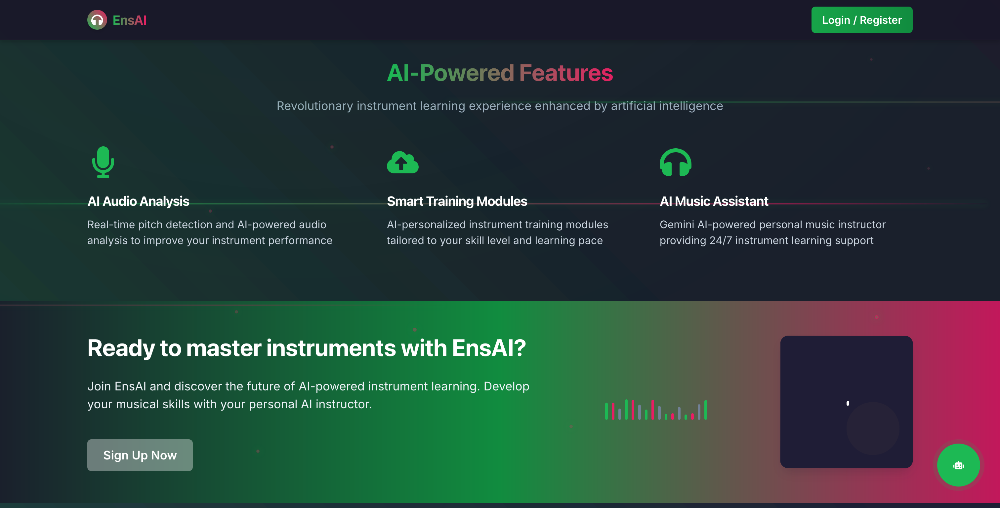
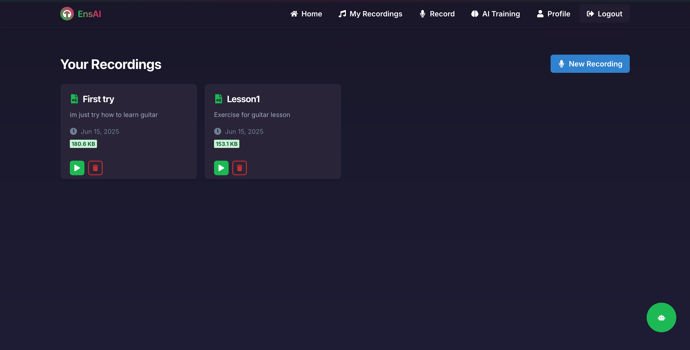
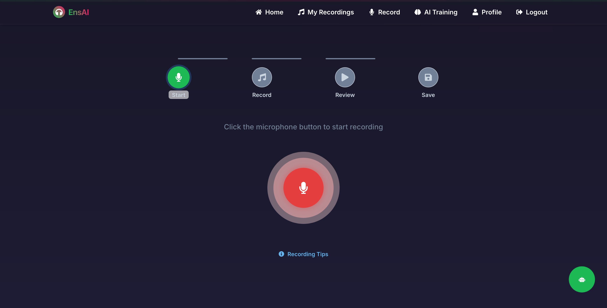
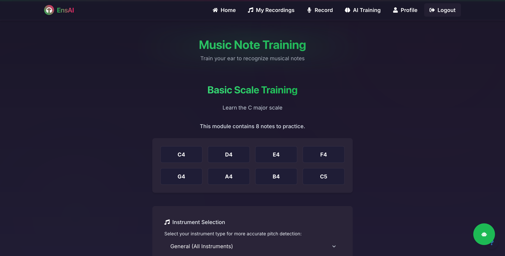
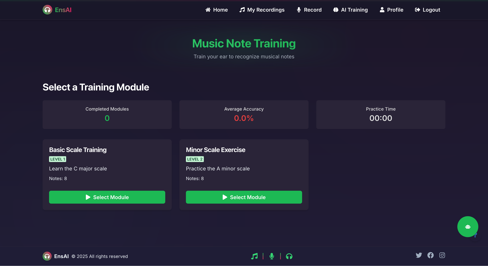
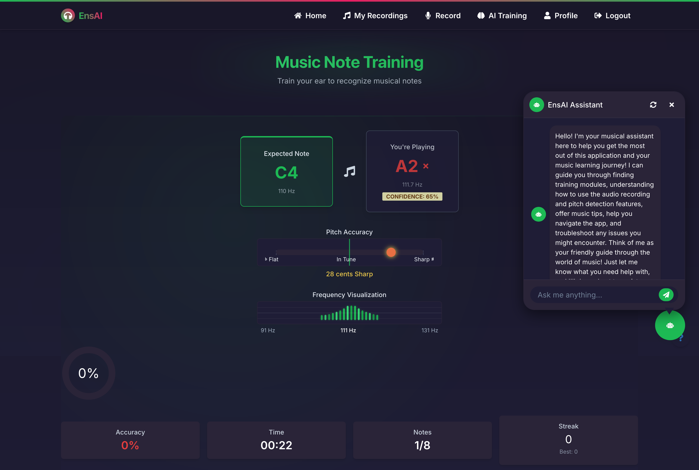
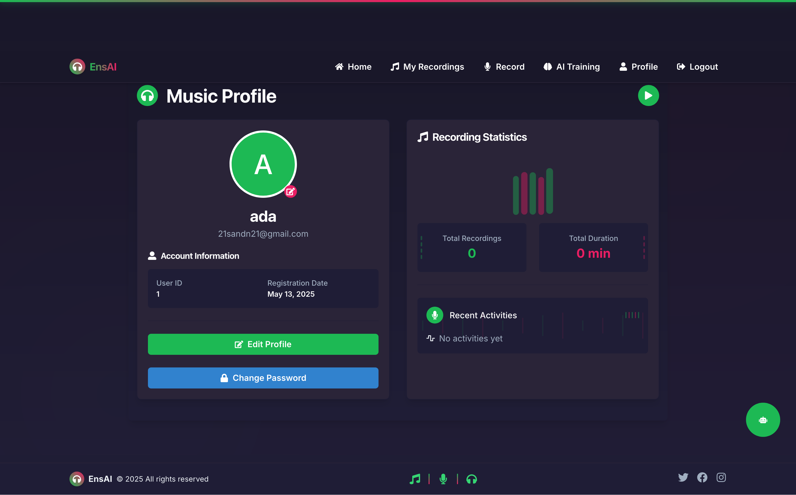

# 🎵 EnsAI - AI-Powered Instrument Learning Platform

**Transform your musical journey with AI-powered personalized instrument learning. Learn piano, guitar, violin and more with your intelligent Gemini AI instructor.**

[](https://ensai-demo.vercel.app)
[](LICENSE)
[](https://github.com/yourusername/ensai)

## 🖼️ Web Application Screenshots

### Home Page - Welcome Interface


*Welcome page showcasing the main features and getting started options*

### Home Features - Main Interface


*Home page's features section*

### Home Footer Overview


*Detailed features showcase and platform capabilities*

### Audio Recordings Library


*Your audio recordings library with playback and management options*

### Voice Recording Interface


*Professional voice recording interface with real-time audio visualization*

### AI Training - Getting Started


*AI training module introduction and setup interface*

### AI Training - Configuration


*AI training configuration and personalization options*

### AI Training - Interactive Session


*Interactive AI training session with real-time feedback and guidance*

### User Profile & Settings


*User profile management and application settings configuration*

## ✨ Key Features

🤖 **AI-Powered Learning**
- Gemini AI personal instructor
- Real-time audio analysis
- Personalized training modules
- Natural language interaction

🎵 **Multi-Instrument Support**
- Piano, Guitar, Violin, Drums
- High-quality audio processing
- Interactive practice sessions
- Performance evaluation

📱 **Cross-Platform**
- Progressive Web App (PWA)
- React Native mobile app
- Offline mode support
- Real-time synchronization

## 🛠️ Tech Stack

| Layer | Technologies |
|-------|-------------|
| **Frontend** | React 19, TypeScript, Chakra UI, Vite |
| **Mobile** | React Native, Expo |
| **Backend** | Node.js, Express, MongoDB |
| **AI** | Google Gemini AI |
| **Audio** | Web Audio API, WaveSurfer.js |

## 🚀 Quick Start

### Prerequisites
- Node.js 18+
- MongoDB
- Gemini AI API Key

### Installation

```bash
# Clone repository
git clone https://github.com/yourusername/ensai.git
cd ensai

# Backend setup
cd backend
npm install
cp .env.example .env  # Add your Gemini API key
npm run dev

# Web frontend setup
cd ../web
npm install
npm run dev

# Mobile app (optional)
cd ../mobile
npm install
npx expo start
```

### Environment Configuration

**Backend (.env)**
```env
GEMINI_API_KEY=your_gemini_api_key
MONGODB_URI=mongodb://localhost:27017/ensai
JWT_SECRET=your_jwt_secret
```

**Web (.env)**
```env
VITE_API_URL=http://localhost:3001/api
VITE_GEMINI_API_KEY=your_gemini_api_key
```

## 🌐 Live Demo

**Try EnsAI now**: [ensai-demo.vercel.app](https://ensai-demo.vercel.app)

**Demo Credentials:**
- Email: `demo@ensai.com`
- Password: `demo123`

## 📱 Mobile App

Download the mobile app for the complete EnsAI experience:

- **iOS**: Available on App Store (Coming Soon)
- **Android**: Available on Google Play (Coming Soon)
- **Expo**: Scan QR code for beta testing

## 🤝 Contributing

We welcome contributions! Please see our [Contributing Guide](CONTRIBUTING.md) for details.

```bash
# Development workflow
1. Fork the repository
2. Create feature branch: git checkout -b feature/amazing-feature
3. Commit changes: git commit -m 'feat: Add amazing feature'
4. Push to branch: git push origin feature/amazing-feature
5. Open Pull Request
```

## 📞 Support & Community

- 💬 **Discord**: [Join our community](https://discord.gg/ensai)
- 🐛 **Issues**: [Report bugs](https://github.com/yourusername/ensai/issues)
- 📧 **Email**: support@ensai.com
- 📖 **Docs**: [Documentation](https://docs.ensai.com)

## 📄 License

This project is licensed under the MIT License - see the [LICENSE](LICENSE) file for details.

---

**🎵 Ready to revolutionize your instrument learning experience?**

[**Start Learning →**](https://ensai-demo.vercel.app) [**Join Community →**](https://discord.gg/ensai) [**View Docs →**](https://docs.ensai.com) 